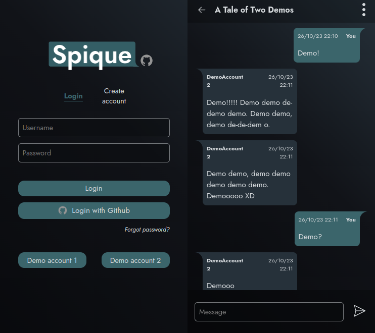

# Spique

Front end: [Live](https://spique.netlify.app) | [Repo](https://github.com/MaoShizhong/Spique)

---

## Backend made with

-   Express/NodeJS
-   Passport ([local](https://www.passportjs.org/packages/passport-local/)/[Github](https://www.passportjs.org/packages/passport-github2/))
-   Bcrypt/node:crypto
-   [Session cookies](https://expressjs.com/en/resources/middleware/session.html)/[Connect-Mongo](https://github.com/jdesboeufs/connect-mongo)
-   [Nodemailer](https://github.com/nodemailer/nodemailer)
-   Mongoose
-   Jest/Supertest/[Mongodb-memory-server](https://github.com/nodkz/mongodb-memory-server)

## Plans

-   Websockets for real time updates for messages/channel updates/friend requests
-   Upload and send locally stored images
-   Display and play embedded video links
-   Allow editing/deleting messages
-   Profile avatars
-   E2E encryption
